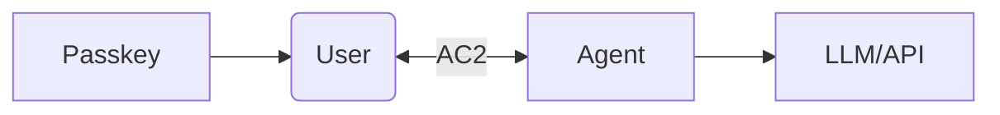
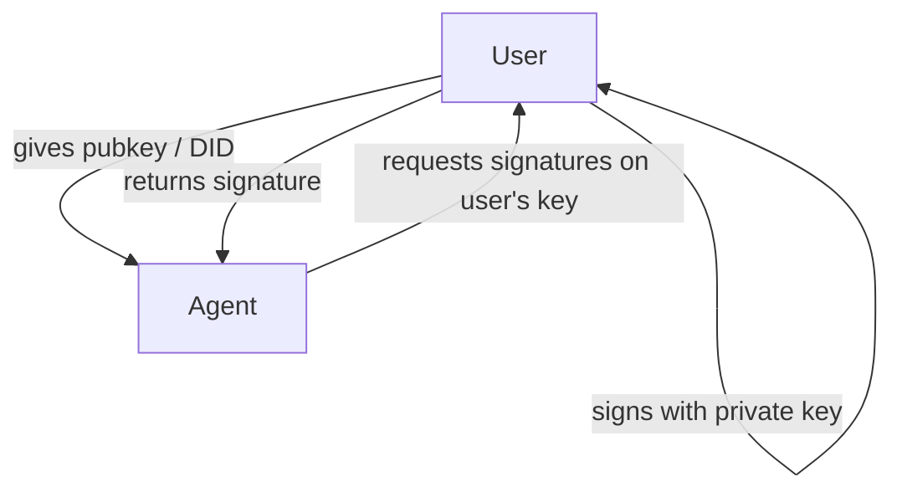
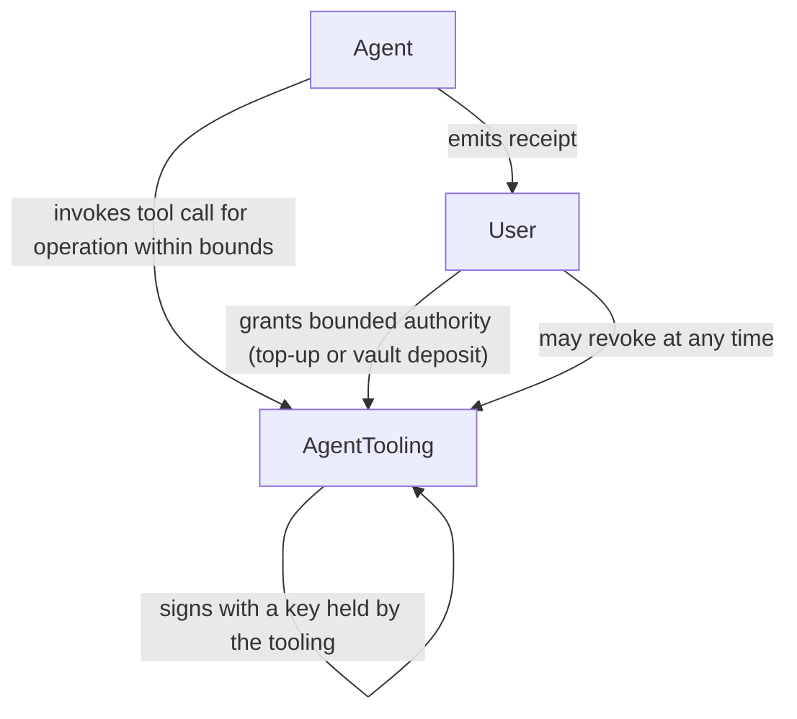

## Abstract

This specification defines the **AC2 (Agentic Communication and Control) Protocol**, a peer-to-peer authenticated messaging system designed for secure communication between users and AI agents. AC2 enables two classes of agent operations: (1) **human-in-the-loop signing**, where agents request signatures from users, who validate and approve through their own wallet or application, with signatures then returned to the agent; and (2) **pre-authorized autonomous operations**, where the agent acts within capabilities the user has granted in advance by invoking its tooling (e.g., agent-internal tools, MCP tools, or OWS wallet toolings) — the tooling produces signatures on keys it holds, not on the user's keys. In all cases the agent itself holds no keys and never sees key material. AC2 never delegates signatures — only capabilities (the right to perform specific intents).

AC2 uses **Liquid Auth** as its transport mechanism - an authenticated peer-to-peer connection establishment protocol that leverages FIDO2/WebAuthn and WebRTC DataChannels to create sovereign, end-to-end encrypted communication channels between controllers (users) and agents. Unlike traditional messaging systems, AC2 does not rely on centralized message relay servers; instead, it establishes direct P2P connections through a signaling service that facilitates the initial handshake.

The protocol supports both real-time streaming for AI interactions (voice, text, or video from the Controller to the agent; voice, text, or file artifacts back from the agent) and request/response patterns for discrete operations. AC2 uses **DIDComm-compliant message formats** [[didcomm-messaging](https://identity.foundation/didcomm-messaging/spec/)], enabling interoperability with existing decentralized identity infrastructure while extending the protocol for real-time streaming use cases.

Authentication leverages Decentralized Identifiers (DIDs) with Passkey-based credentials, providing phishing-resistant security without passwords. AC2 is use-case agnostic, supporting web3 workflows (x402 payments, MPP machine payments — both `charge` and `session` intents), code signing (git commits), document signatures, and any other digital signing operation — whether the signing key is held by the user and the signature is requested per-operation, or held by the agent's tooling and invoked within capabilities the user has granted in advance.

## Status of This Document

This document is a **Draft** specification. It is intended for community review and feedback. Changes are expected as the specification matures.

The key words "MUST", "MUST NOT", "REQUIRED", "SHALL", "SHALL NOT", "SHOULD", "SHOULD NOT", "RECOMMENDED", "NOT RECOMMENDED", "MAY", and "OPTIONAL" in this document are to be interpreted as described in [BCP 14](https://www.rfc-editor.org/info/bcp14) [[RFC2119](https://www.rfc-editor.org/rfc/rfc2119)] [[RFC8174](https://www.rfc-editor.org/rfc/rfc8174)] when, and only when, they appear in all capitals, as shown here.

*This section is non-normative.*

## Introduction

*This section is non-normative.*

### Background

Current messaging systems for AI agent interaction (WhatsApp, Telegram, email) were not designed with autonomous agents in mind. They lack:

1. **Cryptographic identity verification** - No way to verify agent authenticity
2. **Human-in-the-loop signing** - Users must fully trust agents with private keys
3. **Standardized capability grants** - No protocol for temporary, revocable authority
4. **Streaming with authentication** - Real-time AI responses lack proper auth

AC2 addresses these gaps by providing a protocol where:
- Agents MUST NOT access the user's private keys and MUST NOT sign on the user's account
- Users retain unilateral control — either by approving each operation on-the-fly, or by granting bounded, revocable pre-authorization for the agent to invoke its tooling, which signs on keys the tooling holds (the agent itself holds no keys)
- For operations requiring the user's key, agents request and the user approves via familiar interfaces
- For pre-authorized autonomous operations, agents act within the agreed bounds and MUST emit a receipt for every operation
- All communication is authenticated and end-to-end encrypted

### Design Goals

1. **Human-Centric Control**: Users retain control over their own keys and over the authority granted to agents. Control is exercised either per-operation — approving each signing request — or via bounded pre-authorization that can be revoked at any time.
2. **Passwordless Security**: Passkey-based authentication.
3. **Real-Time Streaming**: Support for voice / text / video input from the Controller and voice / text / file artifact output from the agent, with live statistics
4. **Use-Case Agnostic**: Works with any digital signing operation
5. **Privacy-Preserving**: End-to-end encryption, minimal metadata exposure
6. **Interoperable**: Standard message formats, transport agnostic

### Relationship to Other Protocols

| Protocol | Relationship to AC2 |
|----------|---------------------|
| A2A (Agent2Agent) | No direct relationship; AC2 focuses on owner-agent communication |
| MCP (Model Context Protocol) | No direct relationship; AC2 operates at the transport/authentication layer |
| **DIDComm** | **AC2 uses DIDComm v2.0 message format** for plaintext messages, enabling interoperability with existing decentralized identity infrastructure |
| WebAuthn | AC2 uses Liquid Auth which extends FIDO2/WebAuthn with the Liquid Extension |
| **Liquid Auth** | **Required transport layer** for AC2; handles P2P connection establishment and authentication |

### Examples of Use

*This section is non-normative.*

**AI Chat with Voice / Video**: User streams voice or video to the agent; agent streams back a text, voice, or file-artifact response with real-time token usage statistics.

**x402 Payment Flow**:
1. Agent identifies need to pay for API access
2. Agent sends signing request to user
3. User reviews payment details in wallet app
4. User signs the request and the signature is returned to the agent
5. Agent completes payment with user's signature

**MPP Charge (one-off payment — HTTP Payment Authentication Scheme, `charge` intent)**:
1. Agent makes a request to a paid resource
2. Server responds with `402 Payment Required` carrying an MPP challenge for the `charge` intent (e.g., the `algorand` payment method — see draft-algorand-charge)
3. Flow matches x402: human-in-the-loop signing (**Signature Request** pattern), or pre-authorized signing through the agent's tooling (**Pre-Authorized** pattern)
4. Agent submits the signed transaction and emits an AC2 receipt

`note`: __The MPP `charge` intent and x402 serve the same role — a single on-chain settlement per request. An AC2 agent can handle either with the same patterns.__

**MPP Session (metered / streaming — HTTP Payment Authentication Scheme, `session` intent)**:
1. Agent makes a request to a metered API (e.g., LLM inference, streaming data)
2. Server responds with `402 Payment Required` carrying an MPP challenge for the `session` intent (e.g., the `algorand` payment method — see draft-algorand-session)
3. For human-in-the-loop use: agent forwards the channel-open authorization to the user for signing (**Signature Request** pattern); the user signs the deposit transaction group, the signature is returned to the agent, and the agent presents vouchers per metered unit
4. For pre-authorized use: the user has pre-funded a channel or vault in advance (**Pre-Authorized** pattern); the agent opens the MPP session and signs incremental vouchers through its tooling without round-tripping the user
5. Agent emits receipts over AC2 for the session open and, in the pre-authorized case, for each voucher issuance

`note`: __MPP's session/voucher model is a particularly natural fit for pre-authorized autonomous operation — the pre-funded channel is the authority bound, and off-chain vouchers are the incremental claims against it.__

**Git Commit Signing**:
1. Agent prepares code changes
2. Agent requests commit signature from user
3. User reviews diff in signing app
4. User signs with his GPG Key, agent receives signature
5. Agent pushes signed commit

`note`: __The above Git example requires a special GPG bridge program to forward signing requests from the agent to the user's wallet. The bridge itself is outside the scope of this protocol but can be implemented using AC2's signature-request flow.__

**Autonomous API Payment (Pre-Authorized)**:
1. User grants the agent a bounded, revocable payment authority — either by topping up an account controlled by the agent's tooling (agentic-tooling-controlled account), or by depositing into a smart contract vault bound to the agent's account with a cap and validity window
2. Agent encounters an x402 Payment Required response from a paid API
3. Agent causes the payment to be signed and submitted using the account or vault it has authority over — no user round-trip
4. Agent emits an AC2 receipt to the user describing the payment
5. If the authorization is exhausted or revoked, the agent either falls back to the human-in-the-loop flow or halts

**Autonomous Data Signing (Pre-Authorized)**:
1. The agent's tooling exposes a signing capability (e.g., a JWT signer, a non-payment Algorand transaction signer, an attestation signer) whose scope has been configured by the user in advance
2. Agent invokes the tooling, which signs the artifact, without user round-trip
3. Agent emits an AC2 receipt describing the operation

Operations outside the tooling's pre-configured scope fall back to the human-in-the-loop flow.

## Conformance

TBD

## Terminology

TBD 

## Architecture Overview

*This section is non-normative.*

### System Components



### Trust Model

**Human-in-the-loop signing** — agent requests, user signs on their own key:



**Pre-authorized autonomous operation** — agent invokes tooling that signs within bounds granted by the user:



Agents MUST NOT hold keys. Keys are held by the agent's tooling (e.g., agent-internal tools, MCP tools, or OWS wallet toolings); the agent invokes tool calls and the tooling performs any signing.

**Controller Components**:
- **Wallet/Identity Manager**: Liquid Auth-compatible wallet with FIDO2/WebAuthn support
- **Signaling Client**: WebSocket client for Liquid Auth signaling
- **WebRTC Handler**: Manages DataChannel for P2P communication
- **Signing Interface**: Presents operations for user approval
- **AC2 Client**: Processes AC2 messages over DataChannel

**Agent Components**:
- **Signaling Server**: Liquid Auth service for connection establishment
- **Request Builder**: Constructs signing requests with context
- **Signature Response Handler**: Receives issued signatures from Controller
- **AC2 Client**: Processes AC2 messages over DataChannel

**Liquid Auth Infrastructure**:
- **Signaling Server**: WebSocket server for initial handshake. The message-relay and room backing is an implementation choice (e.g., Redis pub/sub, Cloudflare Durable Objects, in-memory for single-node deployments, or equivalent).
- **FIDO2 Server**: Handles WebAuthn attestation and assertion
- **No Message Relay**: Messages flow directly over WebRTC DataChannel

### Communication Patterns

AC2 defines three named communication patterns. Pattern names are the canonical identifiers used throughout this specification and in agent configuration materials. Numbers (1, 2, 3) are ordering hints only and MUST NOT be used as identifiers in agent instructions.

**Streaming (for AI Chat)**
```
Controller ──► Agent:     Stream Request (voice / text / video)
Controller ◄── Agent:     Stream Response (text, voice, or file artifact)
                          ├─ Content chunks
                          ├─ Usage statistics
                          └─ End-of-stream marker
```

**File artifacts**: when the agent produces a file as part of a response (generated document, image, code file, report, etc.), it is delivered as a DIDComm attachment on the relevant response message. Large files MAY be sent as binary DataChannel messages per the WebRTC DataChannel Transport section. Files are not streamed as part of the Streaming token stream — they are discrete artifacts attached to messages.

**Signature Request (for operations on the Controller's keys — x402 with user's wallet, git, documents)**
```
Agent ──► Controller:     Signature Request
         (with context: amount, recipient, purpose)
         
Controller:               Review & Approve (via Passkey auth)

Controller ──► Agent:      Issued Signature
                          (bound to this specific request; single-use)

Agent:                    Execute operation with the issued signature
Agent ──► Controller:     Receipt/Confirmation
```

**Pre-Authorized (for background payments, metered services, tool-scoped data signing)**
```
[Prior]  Controller has granted bounded, revocable authority:
         - Scenario A: Controller topped up an account the agent's
           tooling controls (agentic-tooling-controlled account)
         - Scenario B: Controller deposited into an on-chain vault
           bound to the agent's account with a cap + validity window
         - For non-payment signing: Controller configured the agent's
           tooling with signing capabilities scoped in advance

Agent:                    Invoke tooling to sign and execute the
                          operation within the pre-authorized bounds
                          (no user round-trip)

Agent ──► Controller:     Spend Receipt / Operation Receipt
                          (required for every operation)
```

### Security Model

AC2 assumes a **semi-trusted Agent model**:
- Agents are authenticated (via DID + Passkey)
- Agents MUST NOT access the Controller's private keys and MUST NOT sign on the Controller's account
- For operations on the Controller's keys, Agents MUST request signatures from the Controller and Controllers MUST review each request
- For pre-authorized autonomous operations, Agents act only within the bounds the Controller has granted in advance, signing on keys held by the agent's tooling; Agents MUST emit a receipt for every such operation
- Controllers retain unilateral revocation of pre-authorized bounds at any time
- All communication is encrypted and authenticated

## Data Model

AC2 messages MUST be compliant with [DIDComm v2.0 message formats](https://identity.foundation/didcomm-messaging/spec), with extensions for streaming, signature requests, and capability grants.

### Examples

#### Plan Message Structure

The following structure is based on DIDcommv2 message format, re-used for AC2 messages:

```json
{
  "id": "1234567890",
  "type": "<message-type-uri>",
  "from": "did:example:alice",
  "to": ["did:example:bob"],
  "created_time": 1516269022,
  "expires_time": 1516385931,
  "body": {
    "message_type_specific_attribute": "and its value",
    "another_attribute": "and its value"
  }
}
```


#### With Attachments

```json
{
  "id": "1234567890",
  "type": "<message-type-uri>",
  "from": "did:example:alice",
  "to": ["did:example:bob"],
  "created_time": 1516269022,
  "expires_time": 1516385931,
  "body": {
    "message_type_specific_attribute": "and its value",
    "another_attribute": "and its value"
  },
  "attachments": [
    {
      "id": "attachment-id",
      "media_type": "application/json",
      "data": {
        "json": {
          "key": "value"
        }
      }
    }
  ]
}
```


#### AC2 Message Examples

Capability discovery is handled on-demand via the `ac2/CapabilityList` message and DIDComm `discover-features/2.0`. Problems are reported via DIDComm `report-problem/2.0`.

##### Signing Request

```json
{
  "@context": ["https://ac2.io/v1"],
  "type": "ac2/SigningRequest",
  "from": "did:example:agent",
  "to": ["did:example:user"],
  "created_time": 1700000000,
  "expires_time": 1700003600,
  "body": {
    "description": "Requesting signature for x402 payment",
    "encoding": "base64",
    "payload": "base64-encoded data to sign",
    "schema": "schema of the payload (e.g., x402 payment schema)",
  }
}
```

The `payload` field MUST be shown to the user in both its raw form and a human-readable form (e.g., "Pay 0.5 ALGO to recipient XYZ for API access") before the user approves the signing request.

##### Signing Response

```json
{
  "@context": ["https://ac2.io/v1"],
  "type": "ac2/SigningResponse",
  "from": "did:example:user",
  "to": ["did:example:agent"],
  "created_time": 1700000100,
  "expires_time": 1700003700,
  "body": {
    "signature": "base64-encoded signature",
  }
}
```

##### Signing Rejected

```json
{
  "@context": ["https://ac2.io/v1"],
  "type": "ac2/SigningRejected",
  "from": "did:example:user",
  "to": ["did:example:agent"],
  "created_time": 1700000100,
  "expires_time": 1700003700,
  "body": {
    "reason": "User rejected the signing request"
  }
}
```

#### Pre-Authorized Operation Messages

AC2 recognizes two scenarios in which the Controller may grant the agent bounded authority to act autonomously:

- **Scenario A — Agentic-tooling-controlled account.** The agent has authority over an account whose keys are held by the agent's tooling. The Controller funds this account by responding to a wallet URI exchanged over AC2. The enforcement of the cap is off-chain: the Controller tops up only what they are willing to grant.
- **Scenario B — On-chain vault.** The Controller deposits into a smart contract with a cap, validity window, and the agent's account bound as the sole authorized spender. The contract's design, methods, and on-chain enforcement are defined by a chain-specific companion specification and are out of scope for AC2.

For non-payment data signing, the extent of autonomous authority is defined by the pre-configured signing capabilities exposed by the agent's tooling.

`ac2/AgentSpendReceipt` MUST be sent by the agent for every pre-authorized operation.

##### Capability List

`ac2/CapabilityList` carries the list of AC2 capability identifiers the agent supports. It is sent by the agent at the start of a session (push form) and MAY be requested by either party at any time (pull form, empty body).

Push form:

```json
{
  "@context": ["https://ac2.io/v1"],
  "type": "ac2/CapabilityList",
  "from": "did:example:agent",
  "to": ["did:example:user"],
  "created_time": 1700000000,
  "body": {
    "capabilities": ["x402.pay", "mpp.charge", "mpp.session.voucher"]
  }
}
```

Pull form:

```json
{
  "@context": ["https://ac2.io/v1"],
  "type": "ac2/CapabilityList",
  "from": "did:example:user",
  "to": ["did:example:agent"],
  "created_time": 1700000000,
  "body": {}
}
```

##### Agent Top-Up Request (Scenario A)

Sent by the agent to request funding of its tooling-controlled account. The `topUpUri` uses the wallet URI scheme defined for the target chain (e.g., ARC-26 for Algorand).

```json
{
  "@context": ["https://ac2.io/v1"],
  "type": "ac2/AgentTopUpRequest",
  "from": "did:example:agent",
  "to": ["did:example:user"],
  "created_time": 1700000000,
  "expires_time": 1700003600,
  "body": {
    "reason": "Balance below threshold for pending x402 payments",
    "chain": "algorand:wGHE2Pwdvd7S12BL5FaOP20EGYesN73ktiC1qzkkit8=",
    "asset": { "id": "31566704", "symbol": "USDC" },
    "currentBalance": "1500000",
    "requestedAmount": "10000000",
    "topUpUri": "algorand://AGENT_ACCOUNT_ADDRESS?amount=10000000&asset=31566704"
  }
}
```

##### Agent Capability Grant (Scenario B)

Sent by the Controller to grant the agent a bounded capability backed by an on-chain vault. The `vaultPointer` is a chain-agnostic identifier (e.g., CAIP-10 style) resolvable to the vault's chain, address, and parameters. Cap, window, and state are read from the vault, not from this message.

```json
{
  "@context": ["https://ac2.io/v1"],
  "type": "ac2/AgentCapabilityGrant",
  "from": "did:example:user",
  "to": ["did:example:agent"],
  "created_time": 1700000000,
  "body": {
    "capabilities": ["mpp.charge", "mpp.session.voucher"],
    "vaultPointer": "algorand:wGHE2Pwdvd7S12BL5FaOP20EGYesN73ktiC1qzkkit8=/app/987654321/vault/NTRZR6HGMMZGYMJKUNVNLKLA427ACAVIPFNC6JHA5XNBQQHW7MWA",
    "note": "LLM inference budget for April"
  }
}
```

##### Agent Spend Receipt

Sent by the agent after every pre-authorized operation — payment or non-payment signing. Required.

```json
{
  "@context": ["https://ac2.io/v1"],
  "type": "ac2/AgentSpendReceipt",
  "from": "did:example:agent",
  "to": ["did:example:user"],
  "created_time": 1700001000,
  "body": {
    "operation": "mpp.session.voucher",
    "chain": "algorand:wGHE2Pwdvd7S12BL5FaOP20EGYesN73ktiC1qzkkit8=",
    "asset": { "id": "31566704", "symbol": "USDC" },
    "amount": "25000",
    "recipient": "MERCHANT_ACCOUNT_ADDRESS",
    "txid": "ALGORAND_TX_ID",
    "context": "Voucher issued for LLM inference — 1000 tokens"
  }
}
```

For non-payment signing, `operation` describes the signing category (e.g., `"jwt.sign"`, `"attestation.sign"`) and `chain`/`asset`/`amount`/`recipient` are omitted; `context` describes what was signed in human-readable form.

Wherever a message in this specification carries an `amount`, it MUST be accompanied by a top-level `chain` ([[caip-2](https://github.com/ChainAgnostic/CAIPs/blob/main/CAIPs/caip-2.md)] identifier) and an `asset` identifying the unit. For native chain tokens, `asset.id` uses the chain's zero / native identifier (e.g., `"0"` for ALGO). `symbol` is display-only.

### Liquid Extension

The Liquid Extension extends standard FIDO2/WebAuthn authentication by binding the credential to a blockchain address. This creates a "second signature" where the authenticator signs the WebAuthn challenge with its internal Passkey (P-256), and also produces a signature using an Ed25519 key associated with an Algorand address.

This extension allows the relying party (dApp) to verify that the user not only possesses a valid Passkey but also controls a specific blockchain account.


**Attestation Extension Results**:

```json
{
  "liquid": {
    "type": "algorand",
    "address": "2SPDE6XLJNXFTOO7OIGNRNKSEDOHJWVD3HBSEAPHONZQ4IQEYOGYTP6LXA",
    "signature": "<signature>",
    "requestId": "019097ff-bb8c-7514-a0c6-5209d2405a4a",
    "device": "Pixel 8 Pro"
  }
}
```

The `signature` field in the Assertion result is a base64url-encoded Ed25519 signature of the `challenge` produced by the private key corresponding to the Algorand `address`. This binding ensures that the WebRTC session is established with a verified blockchain identity.

**Assertion Extension Results**:

```json
{
  "liquid": {
    "requestId": "019097ff-bb8c-7514-a0c6-5209d2405a4a"
  }
}
```

### WebRTC DataChannel Transport

Once the Liquid Auth handshake completes, AC2 messages are transported over the WebRTC DataChannel.

**Normative Requirements**:

1. **Channel Label**: The DataChannel MUST be created with label `ac2-v1`
2. **Message Framing**: Each AC2 message MUST be sent as a single DataChannel message
3. **Binary Data**: Attachments MAY be sent as binary DataChannel messages
4. **Ordered Delivery**: The DataChannel MUST be created with `ordered: true`
5. **Encryption**: All messages MUST be end-to-end encrypted via WebRTC's DTLS

**Non-Normative Example**:

```javascript
// Agent creates DataChannel
const dataChannel = peerConnection.createDataChannel('ac2-v1', {
  ordered: true
});

dataChannel.onopen = () => {
  dataChannel.send(JSON.stringify({
    "@context": ["https://ac2.io/v1"],
    "type": "ac2/CapabilityList",
    body: { capabilities: ["x402.pay", "mpp.charge"] }
  }));
};
```

### Signaling Protocol

The signaling server facilitates the WebRTC handshake without accessing message content.

## Authentication

### DID-Based Identity

**Normative Requirements**:

1. **DID Methods**: Implementations MUST support `did:key` per [[did-key](https://w3c-ccg.github.io/did-method-key/)] and SHOULD support `did:web`
2. **Key Types**: Ed25519 keys REQUIRED for signatures; secp256k1 OPTIONAL for blockchain operations; post-quantum schemes such as `falcon-512` OPTIONAL
3. **Resolution**: Implementations MUST resolve DIDs per [[did-resolution](https://w3c-ccg.github.io/did-resolution/)]
4. **Discovery**: Agent DIDs MUST be discoverable via `.well-known/did.json` (for `did:web` DIDs) or `.well-known/did-configuration.json` per [[well-known-did-configuration](https://identity.foundation/.well-known/resources/did-configuration/)] (for any DID method, including `did:key`)

### Agent DID Key Origin

An agent's signing key MAY be produced in either of two ways:

1. **Derived key** — the agent's keypair is deterministically derived from the Controller's seed via an HD scheme appropriate to the key type (e.g., BIP32-Ed25519 / [[ARC-52](https://github.com/algorandfoundation/ARCs/blob/main/ARCs/arc-0052.md)] for Ed25519, BIP32 for secp256k1). HD derivation applies only to key types for which a standard HD scheme exists.
2. **Independent key** — the agent's keypair is generated freshly with no relationship to the Controller's seed.

When derived, the agent DID Document MAY include a `keyOrigin` hint:

```json
"keyOrigin": {
  "method": "arc52",
  "derivationPath": "m/44'/283'/0'/0'/agent/0"
}
```

Consumers MUST NOT rely on `keyOrigin` for trust decisions.

### Capability Discovery

An AC2-compliant agent responding to a DIDComm `discover-features/queries` message MUST include `ac2/capability-list` among the disclosed features.

### Passkey Authentication

**Normative Requirements**:

1. **WebAuthn**: Passkey authentication MUST conform to [[webauthn-2](https://www.w3.org/TR/webauthn-2/)]
2. **Resident Keys**: Authenticators SHOULD support client-side discoverable credentials
3. **User Verification**: User verification (PIN, biometrics) REQUIRED for signing operations
4. **Attestation**: Attestation OPTIONAL but RECOMMENDED for high-security scenarios

**Authentication Flow** (non-normative):

```
Controller                          Agent
     │                               │
     │─── 1. Connect with DID ─────►│
     │                               │
     │◄── 2. Challenge (WebAuthn) ───│
     │                               │
     │─── 3. Passkey Response ───────►│
     │                               │
     │◄── 4. Session Established ────│
```

## Streaming Protocol

AC2 supports real-time streaming (see the Streaming pattern in Architecture Overview). Stream initiation uses a standard DIDComm message; stream chunks are then framed over the established WebRTC DataChannel. Streaming follows the DIDComm threading conventions (`thid` / `pthid`) — the stream spawns a child thread of the initiating request. Concrete stream-chunk framing is out of scope of this version and is expected to be profiled by implementations.

## Privacy Considerations

*This section is non-normative.*

### Data Minimization

AC2 implementations should minimize data collection:

- Don't store message content after delivery
- Don't log unnecessary metadata
- Don't share data with third parties
- Allow users to export and delete their data

### Consent

Controllers should implement:

- Clear consent for session establishment
- Granular consent per operation type
- Ability to review and revoke consent
- Transparency about what agents can access

## Agent Configuration for Digital Signatures

This section applies to signing operations that require the Controller's key. Pre-authorized autonomous operations are specified separately (see the Pre-Authorized pattern and the Pre-Authorized Operation Messages in the Data Model).

### Implementation Layer: AC2 Plugin on the Agent Framework

AC2 enforcement at the agent is realized as a **plugin** loaded by the host agent framework (e.g., Claude Code, OpenClaw). The plugin wires AC2 messages, detects signature events, intercepts operations, and injects the AC2 signing flow.

A conforming AC2 plugin uses the enforcement mechanisms exposed by the host framework. These fall into four classes:

1. **Rules / context / memory markdowns** — framework-specific guidance files read by the LLM (e.g., `CLAUDE.md`, `SOUL.md`, `MEMORY.md`).
2. **Hooks** — pre/post event callbacks the framework exposes (e.g., pre-tool-use, post-message, user-prompt-submit, stop). Invoked regardless of LLM cooperation.
3. **SDK plugin entry points** — typed function registration exposed by the framework's plugin SDK.
4. **Skills** — capability definitions (typically `SKILLS.md` or equivalent).

### Framework Configuration Mechanisms (context-markdown class)

| Mechanism | File/Location | Purpose |
|-----------|---------------|---------|
| **System Instructions** | `SOUL.md`, system prompt, character files | Core identity and constraints |
| **Agent Manifest** | `AGENTS.md` | Behavior rules and message formats |
| **Capability Definition** | `SKILLS.md`, tool schemas | Skill definitions with AC2 workflows |
| **Memory/Context** | `MEMORY.md`, `CLAUDE.md`, conversation history | State tracking and project rules |
| **Identity Declaration** | `IDENTITY.md`, agent cards | Compliance declaration |
| **User Preferences** | `USER.md`, settings | Controller configuration |

### Core Principle

When an agent requires a digital signature **on the Controller's key**, it **MUST**:

1. Request the signature from the controller (user) via AC2 messaging
2. Wait for controller approval and the issued signature
3. Use ONLY the controller-provided signature

The wire format for `ac2/SigningRequest` and `ac2/SigningResponse` is defined in the Data Model section.

### Agent Key Provisioning

The keypair held by the agent's tooling is provisioned outside the AC2 wire protocol using one of the two methods defined in **Agent DID Key Origin** (Authentication section).

#### AC2 KeyRequest / KeyResponse (OPTIONAL — HD-derived provisioning only)

`ac2/KeyRequest` and `ac2/KeyResponse` are **OPTIONAL** messages. They are used only when (a) the Controller chooses HD-derived provisioning of the key held by the agent's tooling, and (b) the tooling supports receiving derived keys via AC2 rather than deriving locally.

When in use, the tooling MAY ask the Controller to derive a keypair at a specified HD path (e.g., BIP32-Ed25519 / [[ARC-52](https://github.com/algorandfoundation/ARCs/blob/main/ARCs/arc-0052.md)]) and deliver the resulting derived private key over AC2. `KeyRequest` MUST NOT be used for independently-generated keys and MUST NEVER be used to request the Controller's root key or any non-derived key.

Origin and destination: the **agent's tooling** originates the request; the agent runtime forwards it over AC2 as a message. The matching response is routed by the plugin directly into the tooling — it MUST NOT be placed in the agent runtime's LLM-visible context.

**KeyRequest** (tooling → Controller, via the agent over AC2):

```json
{
  "@context": ["https://ac2.io/v1"],
  "type": "ac2/KeyRequest",
  "from": "did:example:agent",
  "to": ["did:example:user"],
  "body": {
    "key_type": "ed25519" | "secp256k1" | "falcon-512",
    "derivationPath": "m/44'/283'/0'/0'/agent/0",
    "purpose": "<WHY_NEEDED>",
    "for_operation": "<WHAT_OPERATION>"
  }
}
```

**KeyResponse** (Controller → tooling, via the agent over AC2):

```json
{
  "@context": ["https://ac2.io/v1"],
  "type": "ac2/KeyResponse",
  "from": "did:example:user",
  "to": ["did:example:agent"],
  "body": {
    "status": "approved" | "rejected",
    "derivationPath": "m/44'/283'/0'/0'/agent/0",
    "key_type": "ed25519",
    "material": "<BASE64_OR_ENCRYPTED_KEY_PAYLOAD>",
    "publicKey": "<BASE64_PUBLIC_KEY>",
    "reason": "<OPTIONAL_REJECTION_REASON>"
  }
}
```

**Normative constraints**:

1. **Scope**: `KeyRequest` MUST only be used for HD-derived provisioning of a key to be installed in the agent's tooling. It MUST NOT be used to request the Controller's root key, an existing signing key, or any key not produced by fresh derivation at the requested path.
2. **Confidentiality**: `material` in `KeyResponse` carries a private key. The AC2 transport (Liquid Auth WebRTC DTLS) provides the channel encryption. Implementations SHOULD additionally wrap `material` in an application-layer encryption keyed to the specific tooling (e.g., a session-bound symmetric key negotiated between Controller and tooling).
3. **Runtime isolation**: The AC2 plugin MUST route `KeyResponse` directly to the tooling without placing `material` in the agent runtime's conversational context, logs, or memory. The agent runtime MUST NOT observe `material`.
4. **Single-shot**: A `KeyResponse` delivers the derived key exactly once. Re-derivation requires a fresh `KeyRequest` at the same path (the Controller's seed produces the same key).
5. **User consent**: The Controller MUST explicitly approve each `KeyRequest` via their wallet or key-management tool, with clear display of `derivationPath`, `purpose`, and `for_operation`.

### Framework-Specific Configuration Examples

The markdown examples below are non-normative and show how a compliant AC2 plugin may declare its behavior through the host framework's context files. Concrete filenames vary per framework.

#### CLAUDE.md (Behavior Rules)

```markdown
# CLAUDE.md - AC2 Behavior Rules

## Signing Policy
Every signing operation falls into one of two named patterns:

- **Signature Request** — the signing key belongs to the Controller
  (wallet / SSH / GPG / identity keys). Emit `ac2/SigningRequest`, wait
  for `ac2/SigningResponse`, and use only the issued single-use
  signature.
- **Pre-Authorized** — the operation is covered by an active capability
  grant. Invoke the agent's tooling within the grant's bounds, then
  emit `ac2/AgentSpendReceipt`.

## Prohibitions
- MUST NOT possess, store, or observe private key material.
- MUST NOT reuse a Signature Request signature for a different request.
- MUST NOT act outside the bounds of an active capability grant.
```

#### MEMORY.md (Session State)

```markdown
# MEMORY.md - AC2 Session State

## Pending Signing Requests
Track active `ac2/SigningRequest` entries:
`{ request_id, operation, created_at, timeout_at }`.
Clear on response or timeout. Store no signature material.

## Capability Grants
Record of active `ac2/AgentCapabilityGrant` entries from the Controller:
`{ grant_id, backing_pointer, chain, asset, cap, valid_until, revoked }`.
Authoritative state lives in the backing mechanism (vault, tooling
account, signing scope).

## Receipts
Append-only log of emitted `ac2/AgentSpendReceipt` (metadata only).
```

#### IDENTITY.md (Agent Identity)

```markdown
# IDENTITY.md - Agent Identity

- `did` — this agent's DID
- `name` — human-readable name
- `capabilities` — AC2 capability identifiers this agent supports

Capabilities are announced to the Controller via `ac2/CapabilityList`.
```

## References

### Normative References

- [[did-core](https://www.w3.org/TR/did-core/)] W3C. *Decentralized Identifiers (DIDs) v1.0*. W3C Recommendation. June 2022.
- [[did-key](https://w3c-ccg.github.io/did-method-key/)] CCG. *The did:key Method v1.0*. W3C CCG Draft.
- [[did-resolution](https://w3c-ccg.github.io/did-resolution/)] CCG. *DID Resolution v1.0*. W3C CCG Draft.
- [[well-known-did-configuration](https://identity.foundation/.well-known/resources/did-configuration/)] DIF. *Well-Known DID Configuration*. DIF Spec.
- [[webauthn-2](https://www.w3.org/TR/webauthn-2/)] W3C. *Web Authentication: An API for accessing Public Key Credentials Level 2*. W3C Recommendation.
- [[didcomm-messaging](https://identity.foundation/didcomm-messaging/spec/)] DIF. *DIDComm Messaging Specification v2.0*. DIF Ratified Specification.
- [[RFC2119](https://www.rfc-editor.org/rfc/rfc2119)] Bradner, S. *Key words for use in RFCs to Indicate Requirement Levels*. RFC 2119.
- [[RFC4122](https://www.rfc-editor.org/rfc/rfc4122)] Leach, P., Mealling, M., Salz, R. *A Universally Unique IDentifier (UUID) URN Namespace*. RFC 4122.
- [[RFC6455](https://www.rfc-editor.org/rfc/rfc6455)] Fette, I., Melnikov, A. *The WebSocket Protocol*. RFC 6455.
- [[RFC8174](https://www.rfc-editor.org/rfc/rfc8174)] Leiba, B. *Ambiguity of Uppercase vs Lowercase in RFC 2119 Key Words*. RFC 8174.

### Informative References

- [[caip-10](https://github.com/ChainAgnostic/CAIPs/blob/main/CAIPs/caip-10.md)] CASA. *CAIP-10: Account ID Specification*. (chain-agnostic account identifier format)
- [[x402](https://x402.org)] x402 Protocol. *Cross-Platform Payment Standard*.
- [[mpp-httpauth-payment](https://datatracker.ietf.org/doc/draft-ietf-httpauth-payment/)] Moxey, J. *The "Payment" HTTP Authentication Scheme*. IETF Draft. (Machine Payment Protocol — defines the `charge` and `session` intents framework)
- [[mpp-algorand-charge](https://datatracker.ietf.org/doc/)] Ghiasi, M. *Algorand Charge Intent for HTTP Payment Authentication (draft-algorand-charge)*. Independent Submission. (MPP `charge` intent — one-off payments on Algorand)
- [[mpp-algorand-session](https://datatracker.ietf.org/doc/)] Ghiasi, M. *Algorand Session Intent for HTTP Payment Authentication (draft-algorand-session)*. Independent Submission. (MPP `session` intent — metered / streaming payments on Algorand)
- [[a2a](https://github.com/google/A2A)] Google. *Agent2Agent Protocol*.
- [[mcp](https://github.com/modelcontextprotocol)] Anthropic. *Model Context Protocol*.
- [[ows](https://openwallet.sh/)] *Open Wallet Standard (OWS)*. GitHub: [open-wallet-standard](https://github.com/open-wallet-standard).
- [[liquid-auth](https://github.com/algorandfoundation/liquid-auth)] Algorand Foundation. *Liquid Auth - Open Source P2P Authentication Service*.
- [[webrtc](https://www.w3.org/TR/webrtc/)] W3C. *WebRTC: Real-Time Communication Between Browsers*.
- [[fido2](https://fidoalliance.org/specs/fido-v2.0-ps-20190130/fido-client-to-authenticator-protocol-v2.0-ps-20190130.html)] FIDO Alliance. *Client to Authenticator Protocol (CTAP)*.
- [[twingate](https://www.twingate.com/docs/how-twingate-works)] Twingate. *How Twingate Works - P2P Network Architecture*.

---

Copyright © 2026 Algorand Foundation. This specification is licensed under the [W3C Software and Document License](https://www.w3.org/Consortium/Legal/2015/copyright-software-and-document).
